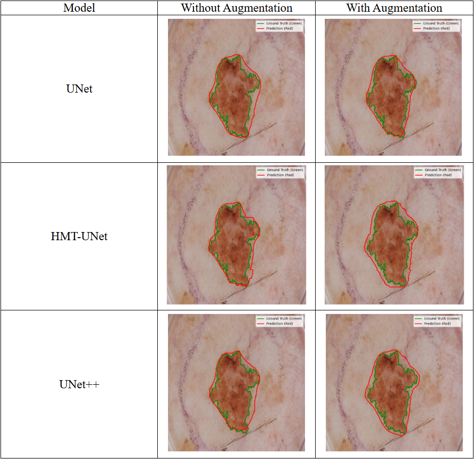

# 用于自动皮肤病变分割的深度学习架构

[](https://www.python.org/)
[](https://pytorch.org/)
[](LICENSE)
[](https://challenge.isic-archive.com/)

> 本项目是一个面向医学图像分割领域的深度学习实战开源项目，专注于**皮肤病变区域的自动分割**。项目以国际皮肤影像协作组发布的 [ISIC 2017](https://challenge.isic-archive.com/) 数据集为核心，系统实现了三套经典的 U-Net 系列分割网络：标准 UNet、嵌套跳跃连接的 UNet++，以及融合 Transformer 机制的 HMTUNet。

---

## 目录

- [核心功能](#核心功能)
- [截图预览](#截图预览)
- [技术栈](#技术栈)
- [项目结构](#项目结构)
- [快速开始](#快速开始)
- [许可证](#许可证)

---

## 核心功能

- **多模型支持**
  - `UNet`：经典对称编码器-解码器结构。
  - `UNetPlusPlus`：嵌套跳跃连接与可选深度监督机制。
  - `HMTUNet`：基于 MambaVision 的高级分割变体。
- **统一配置驱动**
  所有路径、超参数、实验列表集中管理于 `configs/config.yaml`，训练与推理严格一致。
- **丰富的数据增强**
  基于 `albumentations` 实现翻转、旋转、弹性形变、亮度对比度抖动、高斯噪声等增强。
- **全面的评估指标**
  支持 IoU、Dice、Precision、Recall 等六项指标，附带 CSV 汇总与最佳模型可视化。
- **可视化工具集**
  提供单张轮廓叠加对比、批量样本预测对比、雷达图/柱状图/平行坐标图等多模型性能对比绘图。

---

## 截图预览

**模型效果对比**：

<div align="center">
  
</div>

---

## 项目结构

```text
.
├── configs/
│   ├── __init__.py          # 配置加载辅助函数
│   └── config.yaml          # 统一配置文件：路径、超参数、实验列表
├── models/
│   ├── __init__.py          # 模型注册中心
│   ├── unet.py              # UNet & UNet++ 网络结构定义
│   └── hmt_unet/            # HMTUNet 模型包
│       ├── __init__.py
│       ├── hmt_unet.py      # HMTUNet 封装接口
│       ├── transformer.py   # MambaVision 主干网络
│       └── registry.py      # 模型注册工具
├── data_pipeline/
│   ├── __init__.py
│   ├── dataset.py           # ISICDataset / TestDataset 与 Albumentations 增强
│   └── preprocess.py        # ISIC 2017 数据预处理脚本
├── utils/
│   ├── __init__.py
│   ├── metrics.py           # IoU / Dice / Precision / Recall / Specificity / Accuracy
│   └── visualization.py     # 分割结果可视化与对比绘图辅助
├── tools/
│   ├── train.py             # 训练入口：5 折交叉验证
│   ├── test.py              # 测试入口：指标评测与最优模型可视化
│   ├── single_img.py        # 单张图像推理与轮廓叠加可视化
│   └── evaluate_visualization.py  # 历史实验结果雷达图/柱状图对比
├── checkpoints/             # 模型权重保存目录
├── outputs/                 # 评估结果与 CSV 输出目录
├── data/                    # 数据集目录
├── .gitignore
└── README.md
```

---

## 快速开始

### 环境准备

本项目基于 **Python 3.9+** 与 **PyTorch 1.12+** 构建，推荐使用 Conda 创建虚拟环境：

```bash
# 1. 创建并激活虚拟环境（示例使用名为 skinSeg 的环境）
conda create -n skinSeg python=3.9
conda activate skinSeg

# 2. 安装核心依赖
pip install torch torchvision
pip install albumentations timm scikit-image
pip install opencv-python pillow tqdm pandas matplotlib numpy
pip install pyyaml scikit-learn
```

> 💡 **提示**：若使用 GPU，请根据 [PyTorch 官网](https://pytorch.org/get-started/locally/) 选择对应的 CUDA 版本安装命令。

### 模型训练

1. **准备数据**：下载 [ISIC 2017 数据集](https://challenge.isic-archive.com/data/)，按原始目录结构放入 `./data/` 下，然后运行预处理：

   ```bash
   python data_pipeline/preprocess.py
   ```
2. **修改配置**：编辑 `configs/config.yaml`，确保 `data.processed_root` 指向正确的预处理数据路径。
3. **启动训练**：

   ```bash
   # 使用默认配置文件开始 5 折交叉验证训练
   python tools/train.py
   
   # 或指定自定义配置文件
   python tools/train.py --config configs/config.yaml
   ```

   训练过程中，最佳模型权重将自动保存至 `./checkpoints/` 目录，命名格式为 `{experiment_name}_fold{N}_best.pth`。

### 模型评估

1. **配置测试权重路径**：在 `configs/config.yaml` 的 `checkpoint.test_model_paths` 中填入待测试的 `.pth` 文件路径列表。
2. **运行测试脚本**：

   ```bash
   # 自动计算 IoU、Dice 等指标，生成 CSV 汇总并可视化最佳模型
   python tools/test.py
   ```
3. **单张图像可视化**：

   ```bash
   # 使用配置文件中的默认图像与权重
   python tools/single_img.py
   
   # 或通过命令行指定任意图像与权重
   python tools/single_img.py \
       --model HMTUNet \
       --weight ./checkpoints/HMTUNet_with_Augmentation_fold1_best.pth \
       --image ./data/processed/test/images/ISIC_0012330.jpg \
       --mask ./data/processed/test/masks/ISIC_0012330_segmentation.png
   ```

---

## 许可证

本项目基于 [MIT License](LICENSE) 开源，你可以自由使用、修改和分发本项目的代码，但请在衍生作品中保留原始许可证声明。本项目仅供学术研究、教学与个人学习使用，**不作为医疗器械或临床诊断依据**。

```
MIT License

Copyright (c) 2026 Tianxiang Li

Permission is hereby granted, free of charge, to any person obtaining a copy
of this software and associated documentation files (the "Software"), to deal
in the Software without restriction, including without limitation the rights
to use, copy, modify, merge, publish, distribute, sublicense, and/or sell
copies of the Software, and to permit persons to whom the Software is
furnished to do so, subject to the following conditions:

The above copyright notice and this permission notice shall be included in all
copies or substantial portions of the Software.
```

---

> 如果你在学习过程中有任何问题，欢迎提交 [Issue](https://github.com/[YourUsername]/MusicPlayer4/issues) 或 [Pull Request](https://github.com/[YourUsername]/MusicPlayer4/pulls)。祝你学习愉快！
>
> ⭐ 如果这个项目对你有帮助，欢迎 Star 支持！
